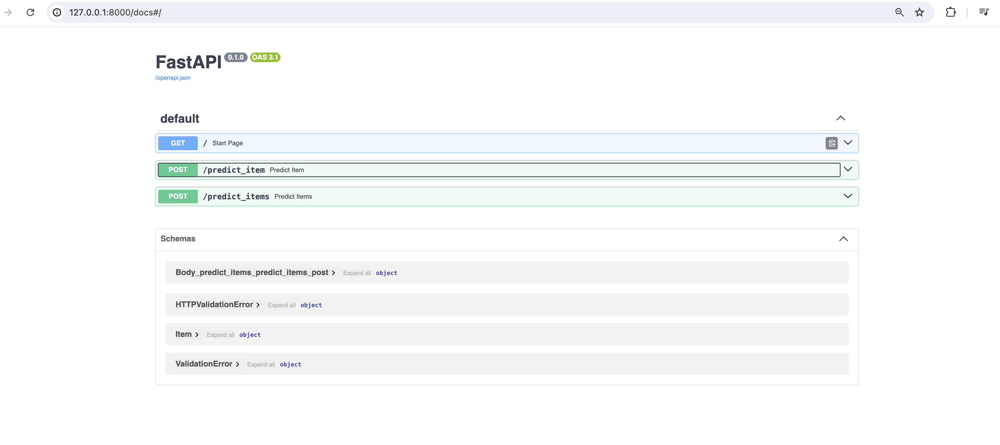
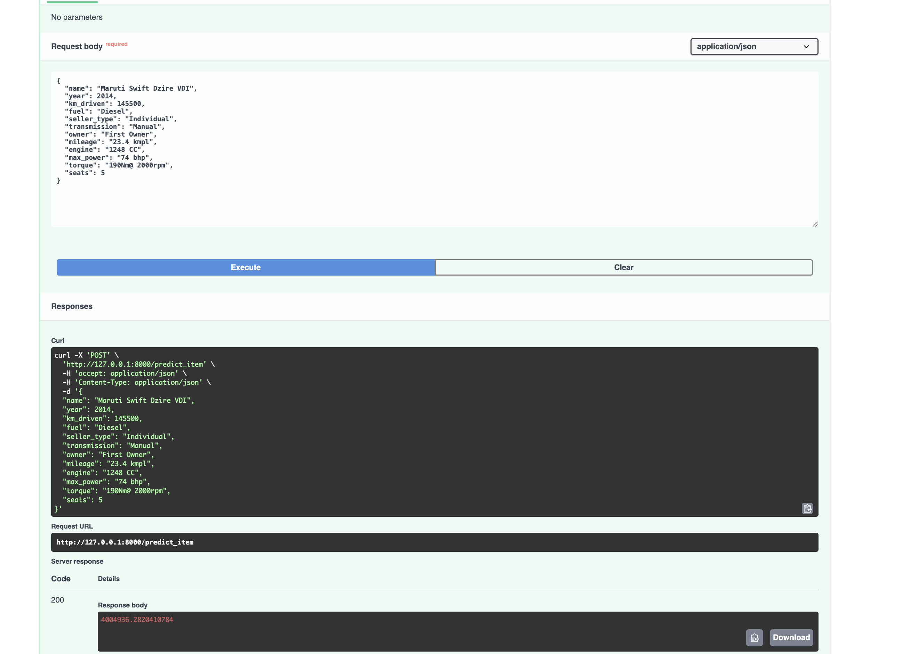
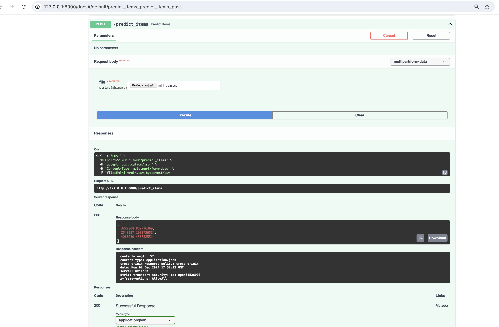

### Что было сделано
Кажется вообще все. Хоть и домашнее было огромным и я мог что-то пропустить.  
Из дополнительных пунктов - AdjustedR2, Polynomial Features и log таргета, доп визуализация.  
А если не по пунктам задания:  
- Визуализция: таблички корреляций, самих признаков в репорте.  
- Анализ и парсинг данных: удаление дубликатов, заполнение пропусков, парсинг колонок.  
- Feature Engineering: One Hot encoding, polynomial features, normalization.  
- Обучение разных моделей: Linear Regression, Ridge, Elastinc Net, Lasso. + Кросс валидация
И еще разные другие таски.

### Результаты
На численных фичах модели не могли выйти за r2 = 0.6: регулиризация, нормализация и перебор гиперпараметров не помогал.  
Категориальные фичи c OHE вывели модель на r2 = 0.78.  
Логарифмирование таргета с предыдущими пункатми получило r2=0.91. - НАИБОЛЬШИЙ БУСТ В КАЧЕСТВЕ
И наконец еще добавление полиномиальных численных признаков вывело все на r=0.94.
Все метрики на тесте.

Не вышло оценить переобучение после добавления полиномиальных фичей ПОТОМУ ЧТО ЗАВТРА У МЕНЯ IELTS А Я СИЖУ И ДОПИСЫВАЮ ЭТУ ШТУКУ. 
А если серьещно, из заданий кажется все получилось. Разве что есть умнее способ считать L0, но тут я сильно удивлюсь.
Я правда не знаю, что здесь писать.

### Фотографии сервиса

